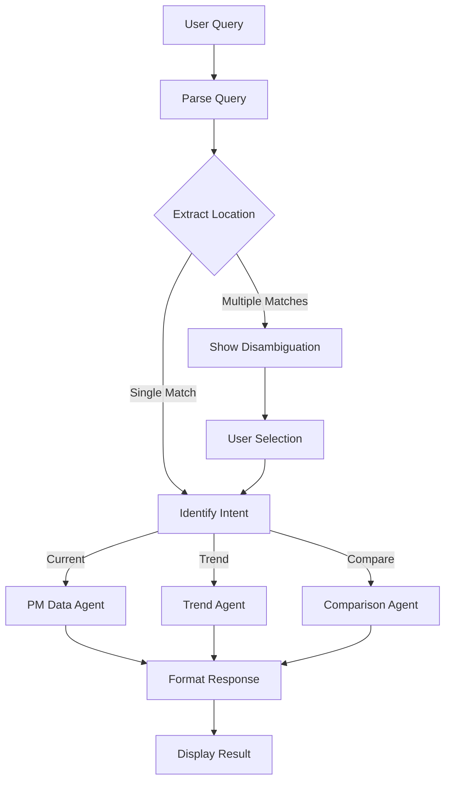

# Air Quality Q&A Agent Implementation Plan - v4
## Multi-Agent System with LangGraph & PostgreSQL Functions

---

## Executive Summary

A production-ready Q&A agent system for Air Quality Monitoring using LangGraph orchestration, PostgreSQL functions for data logic, and Streamlit for user interface. The system implements a clean separation between data logic (in database) and agent logic (in Python).

**Project Status:** Phase 2 - Intelligence Layer Implementation  
**Completion:** ~40% (Foundation complete, enhancing intelligence)  
**Architecture:** Multi-agent with LangGraph orchestration  
**Data Strategy:** PostgreSQL functions for all data operations  
**UI:** Streamlit chat with disambiguation support  

---

## Table of Contents

1. [Current Implementation Status](#current-implementation-status)
2. [System Architecture](#system-architecture)
3. [Implementation Phases](#implementation-phases)
4. [Code Components](#code-components)
5. [Database Functions](#database-functions)
6. [Testing Strategy](#testing-strategy)
7. [Deployment Guide](#deployment-guide)
8. [Performance Optimization](#performance-optimization)
9. [Future Roadmap](#future-roadmap)

---

## Current Implementation Status

### ✅ Completed Components

#### **Core Infrastructure**
- PostgreSQL/TimescaleDB connection with asyncpg
- Environment configuration (.env)
- Base agent architecture with error handling
- Async/await throughout the system

#### **Database Functions**
```sql
-- Implemented
✅ gis.search_location_json(location_text) -- Returns multiple location matches
✅ gis.get_current_pm25(code, level)       -- Returns current PM2.5 for location

-- To Implement
🔄 gis.get_pm25_trend(code, level, duration, unit)
🔄 gis.compare_locations_pm25(codes[], levels[])
🔄 gis.get_forecast_pm25(code, level, hours)
🔄 gis.get_hotspots(region, threshold)
```

#### **Agents**
```python
✅ LocationResolverAgent  # Searches and returns all location matches
✅ PMDataAgent           # Fetches PM2.5 data for specific location
✅ AgentBase            # Abstract base class with error handling
🔄 TrendAgent          # Fetches historical trends
🔄 ComparisonAgent     # Compares multiple locations
🔄 ForecastAgent       # Gets predictions
```

#### **Workflows**
```python
✅ PMQueryWorkflow      # Basic flow with disambiguation
🔄 MultiIntentWorkflow  # Handles multiple query types
```

#### **User Interface**
- ✅ Streamlit chat interface
- ✅ Disambiguation button display
- ✅ Session state management
- ✅ Example queries sidebar
- 🔄 Chart visualizations
- 🔄 Export functionality

### 🚧 In Progress

- Enhanced query parsing with NLP
- Pattern matching for common queries
- Caching layer implementation
- Multiple agent types (Trend, Comparison)
- LLM fallback for complex queries

---

## System Architecture

### High-Level Architecture

```
┌─────────────────────────────────────────────────────────┐
│                   User Interface Layer                  │
│                  (Streamlit Chat App)                   │
└─────────────────────┬───────────────────────────────────┘
                      │
┌─────────────────────▼───────────────────────────────────┐
│                  Orchestration Layer                    │
│                  (LangGraph Workflows)                  │
│  ┌─────────────────────────────────────────────────┐    │
│  │ • Query Parsing                                 │    │
│  │ • Intent Classification                         │    │
│  │ • Entity Extraction                             │    │
│  │ • Disambiguation Handling                       │    │
│  └─────────────────────────────────────────────────┘    │
└─────────────────────┬───────────────────────────────────┘
                      │
┌─────────────────────▼───────────────────────────────────┐
│                    Agent Layer                          │
│  ┌──────────┐  ┌──────────┐  ┌──────────┐               │
│  │Location  │  │PM Data   │  │Trend     │               │
│  │Resolver  │  │Agent     │  │Agent     │  ...          │
│  └──────────┘  └──────────┘  └──────────┘               │
└─────────────────────┬───────────────────────────────────┘
                      │
┌─────────────────────▼───────────────────────────────────┐
│                  Data Access Layer                      │
│                (PostgreSQL Functions)                   │
│  • gis.search_location_json()                           │
│  • gis.get_current_pm25()                               │
│  • gis.get_pm25_trend()                                 │
│  • gis.compare_locations_pm25()                         │
└─────────────────────────────────────────────────────────┘
```

### Query Flow Diagram



---

## Implementation Phases

### Phase 1: Foundation (Weeks 1-2) ✅ COMPLETED

**Achievements:**
- Basic agent structure
- Database connection
- Location disambiguation
- Simple chat interface
- LangGraph workflow

### Phase 2: Intelligence Layer (Weeks 3-4) 🚧 CURRENT

**Week 3 Tasks:**

#### 2.1 Query Parser Implementation

```python
# src/agents/query_parser.py
import re
from typing import Dict, Any, List, Optional, Tuple
from datetime import datetime, timedelta
from dataclasses import dataclass

@dataclass
class ParsedQuery:
    intent: str
    entities: Dict[str, Any]
    confidence: float
    raw_query: str
    
class QueryParser:
    def __init__(self):
        self.location_keywords = set()  # Load from DB
        self.metric_synonyms = {
            'pm': 'pm25', 'pm2.5': 'pm25', 'pm25': 'pm25',
            'aqi': 'aqi', 'air quality': 'aqi', 'air quality index': 'aqi',
            'no2': 'no2', 'nitrogen': 'no2',
            'so2': 'so2', 'sulfur': 'so2',
            'ozone': 'o3', 'o3': 'o3'
        }
        self._compile_patterns()
    
    def _compile_patterns(self):
        """Compile regex patterns for different query types"""
        self.patterns = {
            'current_reading': [
                (r"(?:what(?:'s| is)|show me|tell me) (?:the )?(?:current |latest |present )?(\w+)(?: level| reading)? (?:in|at|for) ([\w\s]+?)(?:\?|$)", 2),
                (r"(\w+) in ([\w\s]+?)(?:\?|$)", 2),
                (r"([\w\s]+?) (\w+) level", 2)
            ],
            'trend': [
                (r"(?:show |display |get )?(\w+) (?:trend|history|pattern) (?:for |in )?([\w\s]+?) (?:for |over )?(?:the )?(?:last|past) (\d+) (\w+)", 4),
                (r"([\w\s]+?) (\w+) (?:for |over )?(?:the )?(?:last|past) (\d+) (\w+)", 4),
                (r"how (?:has |did )(\w+) (?:changed?|varied) in ([\w\s]+?) (?:over |in )?(?:the )?(?:last|past) (\d+) (\w+)", 4)
            ],
            'comparison': [
                (r"compare (\w+) (?:between |in |across )([\w\s]+?) (?:and|with|vs) ([\w\s]+)", 3),
                (r"([\w\s]+?) vs\.? ([\w\s]+?)(?: for)? (\w+)", 3),
                (r"which (?:is |has )(?:better|worse|higher|lower)(?: \w+)? ([\w\s]+?) or ([\w\s]+)", 2)
            ],
            'forecast': [
                (r"(?:what will|predict|forecast|expected) (\w+) (?:be |in |for )?([\w\s]+?) (?:tomorrow|today|next (\d+) (\w+))", 4),
                (r"([\w\s]+?) (\w+) forecast(?: for)? (?:next |coming )?(\d+)? ?(\w+)?", 4)
            ],
            'hotspot': [
                (r"(?:show |find |get )?(?:pollution |air quality )?hotspots? (?:in |for |around )?([\w\s]+)?", 1),
                (r"(?:most |least )polluted (?:areas?|locations?|places?) (?:in |around )?([\w\s]+)?", 1)
            ]
        }
    
    def parse(self, query: str) -> ParsedQuery:
        """Parse query and extract intent and entities"""
        query_lower = query.lower().strip()
        
        # Try each pattern type
        for intent, patterns in self.patterns.items():
            for pattern_tuple in patterns:
                pattern = pattern_tuple[0]
                expected_groups = pattern_tuple[1] if len(pattern_tuple) > 1 else 1
                
                match = re.search(pattern, query_lower)
                if match:
                    entities = self._extract_entities(match, intent, expected_groups)
                    confidence = self._calculate_confidence(query_lower, intent, entities)
                    
                    return ParsedQuery(
                        intent=intent,
                        entities=entities,
                        confidence=confidence,
                        raw_query=query
                    )
        
        return ParsedQuery(
            intent='unknown',
            entities={'query': query},
            confidence=0.0,
            raw_query=query
        )
```

#### 2.2 Caching Implementation

```python
# src/utils/cache.py
import hashlib
import json
import asyncio
from datetime import datetime, timedelta
from typing import Dict, Any, Optional, Callable
from dataclasses import dataclass

@dataclass
class CacheEntry:
    key: str
    value: Any
    created_at: datetime
    ttl_seconds: int
    hit_count: int = 0
    
    def is_expired(self) -> bool:
        return datetime.now() > self.created_at + timedelta(seconds=self.ttl_seconds)

class QueryCache:
    """In-memory cache with TTL support"""
    
    def __init__(self, default_ttl_seconds: int = 3600):
        self.cache: Dict[str, CacheEntry] = {}
        self.default_ttl = default_ttl_seconds
        self.stats = {'hits': 0, 'misses': 0, 'evictions': 0}
        asyncio.create_task(self._cleanup_expired())
    
    def _generate_key(self, *args, **kwargs) -> str:
        """Generate cache key from arguments"""
        key_data = {'args': args, 'kwargs': kwargs}
        key_str = json.dumps(key_data, sort_keys=True, default=str)
        return hashlib.md5(key_str.encode()).hexdigest()
    
    async def get(self, key: str) -> Optional[Any]:
        """Get value from cache"""
        if key in self.cache:
            entry = self.cache[key]
            if not entry.is_expired():
                entry.hit_count += 1
                self.stats['hits'] += 1
                return entry.value
            else:
                del self.cache[key]
                self.stats['evictions'] += 1
        
        self.stats['misses'] += 1
        return None
    
    async def set(self, key: str, value: Any, ttl: Optional[int] = None) -> None:
        """Set value in cache"""
        ttl = ttl or self.default_ttl
        self.cache[key] = CacheEntry(
            key=key,
            value=value,
            created_at=datetime.now(),
            ttl_seconds=ttl
        )
    
    async def get_or_compute(self, 
                            key: str, 
                            compute_fn: Callable,
                            ttl: Optional[int] = None) -> Any:
        """Get from cache or compute if not present"""
        cached = await self.get(key)
        if cached is not None:
            return cached
        
        # Compute value
        if asyncio.iscoroutinefunction(compute_fn):
            value = await compute_fn()
        else:
            value = compute_fn()
        
        # Cache it
        await self.set(key, value, ttl)
        return value
    
    async def _cleanup_expired(self):
        """Background task to clean up expired entries"""
        while True:
            await asyncio.sleep(300)  # Run every 5 minutes
            expired_keys = [
                key for key, entry in self.cache.items() 
                if entry.is_expired()
            ]
            for key in expired_keys:
                del self.cache[key]
                self.stats['evictions'] += 1
```

#### 2.3 Additional Agents

```python
# src/agents/trend_agent.py
from typing import Dict, Any, List
from .agent_base import AgentBase

class TrendAgent(AgentBase):
    """Agent for handling trend queries"""
    
    def __init__(self, db_connection):
        super().__init__(name="TrendAgent")
        self.db = db_connection
    
    async def run(self, input_data: Dict[str, Any]) -> Dict[str, Any]:
        """
        Fetch trend data for a location
        """
        location_code = input_data.get("location_code")
        location_level = input_data.get("location_level")
        metric = input_data.get("metric", "pm25")
        duration = input_data.get("duration", 24)
        unit = input_data.get("unit", "hours")
        
        self.log(f"Fetching {metric} trend for {location_code} over {duration} {unit}")
        
        try:
            result = await self.db.execute_query(
                """
                SELECT * FROM gis.get_pm25_trend($1, $2, $3, $4)
                ORDER BY timestamp DESC
                """,
                [location_code, location_level, duration, unit]
            )
            
            if not result:
                return {
                    "success": False,
                    "error": "No trend data available"
                }
            
            # Calculate statistics
            values = [r['value'] for r in result if r.get('value') is not None]
            
            trend_analysis = {
                "data_points": result,
                "statistics": {
                    "mean": sum(values) / len(values) if values else 0,
                    "max": max(values) if values else 0,
                    "min": min(values) if values else 0,
                    "trend_direction": self._calculate_trend(values)
                },
                "time_range": {
                    "start": result[-1]['timestamp'] if result else None,
                    "end": result[0]['timestamp'] if result else None,
                    "duration": duration,
                    "unit": unit
                }
            }
            
            return {
                "success": True,
                "trend_data": trend_analysis,
                "location": {
                    "code": location_code,
                    "level": location_level
                },
                "metric": metric
            }
            
        except Exception as e:
            return self.handle_error(e, input_data)
    
    def _calculate_trend(self, values: List[float]) -> str:
        """Calculate trend direction"""
        if len(values) < 2:
            return "insufficient_data"
        
        first_half = sum(values[:len(values)//2]) / (len(values)//2)
        second_half = sum(values[len(values)//2:]) / (len(values) - len(values)//2)
        
        if second_half > first_half * 1.1:
            return "increasing"
        elif second_half < first_half * 0.9:
            return "decreasing"
        else:
            return "stable"
```

```python
# src/agents/comparison_agent.py
from typing import Dict, Any, List
from .agent_base import AgentBase

class ComparisonAgent(AgentBase):
    """Agent for comparing air quality across locations"""
    
    def __init__(self, db_connection):
        super().__init__(name="ComparisonAgent")
        self.db = db_connection
    
    async def run(self, input_data: Dict[str, Any]) -> Dict[str, Any]:
        """Compare air quality across multiple locations"""
        locations = input_data.get("locations", [])
        metric = input_data.get("metric", "pm25")
        time_range = input_data.get("time_range", "current")
        
        if not locations or len(locations) < 2:
            return {
                "success": False,
                "error": "Need at least 2 locations for comparison"
            }
        
        self.log(f"Comparing {metric} across {len(locations)} locations")
        
        try:
            comparison_data = []
            
            for location in locations:
                if time_range == "current":
                    result = await self.db.execute_query(
                        "SELECT * FROM gis.get_current_pm25($1, $2)",
                        [location['code'], location['level']]
                    )
                else:
                    result = await self.db.execute_query(
                        "SELECT * FROM gis.get_pm25_aggregated($1, $2, $3)",
                        [location['code'], location['level'], time_range]
                    )
                
                if result:
                    comparison_data.append({
                        "location": location,
                        "value": result[0].get('pm25_value'),
                        "timestamp": result[0].get('timestamp'),
                        "additional_metrics": result[0]
                    })
            
            comparison_data.sort(key=lambda x: x['value'] or float('inf'))
            
            insights = self._generate_insights(comparison_data)
            
            return {
                "success": True,
                "comparison_data": comparison_data,
                "insights": insights,
                "metric": metric,
                "time_range": time_range
            }
            
        except Exception as e:
            return self.handle_error(e, input_data)
    
    def _generate_insights(self, data: List[Dict]) -> Dict[str, Any]:
        """Generate comparison insights"""
        values = [d['value'] for d in data if d['value'] is not None]
        
        if not values:
            return {"error": "No valid data for comparison"}
        
        best = data[0]
        worst = data[-1]
        
        return {
            "best_location": best['location']['name'],
            "best_value": best['value'],
            "worst_location": worst['location']['name'],
            "worst_value": worst['value'],
            "difference": worst['value'] - best['value'],
            "all_safe": all(v <= 60 for v in values),
            "all_unhealthy": all(v > 90 for v in values)
        }
```

### Phase 3: Production Readiness (Weeks 5-6)

#### 3.1 FastAPI Implementation

```python
# src/api/main.py
from fastapi import FastAPI, WebSocket, WebSocketDisconnect, HTTPException
from fastapi.middleware.cors import CORSMiddleware
from pydantic import BaseModel
from typing import Optional, List, Dict, Any
import json
import asyncio

app = FastAPI(title="Air Quality Q&A Agent")

# Add CORS
app.add_middleware(
    CORSMiddleware,
    allow_origins=["*"],
    allow_methods=["*"],
    allow_headers=["*"],
)

class QueryRequest(BaseModel):
    query: str
    user_id: Optional[str] = None
    cache: bool = True
    context: Optional[Dict[str, Any]] = None

class QueryResponse(BaseModel):
    success: bool
    data: Optional[Dict[str, Any]]
    message: Optional[str]
    metadata: Dict[str, Any]

@app.post("/query", response_model=QueryResponse)
async def process_query(request: QueryRequest):
    """Process a natural language query"""
    try:
        # Check cache if enabled
        if request.cache:
            cache_key = cache._generate_key(request.query)
            cached = await cache.get(cache_key)
            if cached:
                return QueryResponse(
                    success=True,
                    data=cached,
                    metadata={"source": "cache", "cached": True}
                )
        
        # Process through workflow
        workflow_result = await workflow.process_query(request.query)
        
        # Cache result
        if request.cache and workflow_result.get("success"):
            await cache.set(cache_key, workflow_result, ttl=3600)
        
        # Log for training data
        await training_logger.log(request.query, workflow_result)
        
        return QueryResponse(
            success=workflow_result.get("success", False),
            data=workflow_result,
            metadata={
                "source": "computed",
                "cached": False,
                "confidence": workflow_result.get("confidence", 1.0)
            }
        )
        
    except Exception as e:
        raise HTTPException(status_code=500, detail=str(e))

@app.websocket("/ws")
async def websocket_endpoint(websocket: WebSocket):
    """WebSocket endpoint for real-time chat"""
    await websocket.accept()
    session_id = str(uuid.uuid4())
    
    try:
        while True:
            data = await websocket.receive_text()
            query_data = json.loads(data)
            
            # Process query
            result = await process_query(QueryRequest(**query_data))
            
            # Send response
            await websocket.send_json({
                "type": "response",
                "data": result.dict(),
                "session_id": session_id
            })
            
    except WebSocketDisconnect:
        print(f"Client {session_id} disconnected")
    except Exception as e:
        await websocket.send_json({
            "type": "error",
            "message": str(e)
        })

@app.get("/health")
async def health_check():
    """Health check endpoint"""
    return {
        "status": "healthy",
        "timestamp": datetime.now().isoformat(),
        "cache_stats": cache.get_stats()
    }
```

#### 3.2 Monitoring & Logging

```python
# src/utils/monitoring.py
import structlog
from datetime import datetime
from typing import Dict, Any, Optional
import asyncio
from prometheus_client import Counter, Histogram, Gauge

# Configure structured logging
structlog.configure(
    processors=[
        structlog.stdlib.filter_by_level,
        structlog.stdlib.add_logger_name,
        structlog.stdlib.add_log_level,
        structlog.stdlib.PositionalArgumentsFormatter(),
        structlog.processors.TimeStamper(fmt="iso"),
        structlog.processors.StackInfoRenderer(),
        structlog.processors.format_exc_info,
        structlog.processors.UnicodeDecoder(),
        structlog.processors.JSONRenderer()
    ],
    context_class=dict,
    logger_factory=structlog.stdlib.LoggerFactory(),
    cache_logger_on_first_use=True,
)

# Prometheus metrics
query_counter = Counter('agent_queries_total', 'Total queries processed', ['intent', 'status'])
query_duration = Histogram('agent_query_duration_seconds', 'Query processing duration', ['intent'])
active_sessions = Gauge('agent_active_sessions', 'Number of active chat sessions')
cache_hit_rate = Gauge('agent_cache_hit_rate', 'Cache hit rate')

class QueryMonitor:
    def __init__(self):
        self.logger = structlog.get_logger()
        self.metrics = {
            'total_queries': 0,
            'successful_queries': 0,
            'failed_queries': 0,
            'avg_response_time': 0,
            'intents': {}
        }
    
    async def log_query(self, 
                       query: str, 
                       result: Dict[str, Any], 
                       duration_ms: float):
        """Log query execution"""
        intent = result.get('intent', 'unknown')
        success = result.get('success', False)
        
        # Update metrics
        self.metrics['total_queries'] += 1
        if success:
            self.metrics['successful_queries'] += 1
        else:
            self.metrics['failed_queries'] += 1
        
        # Update intent counts
        if intent not in self.metrics['intents']:
            self.metrics['intents'][intent] = 0
        self.metrics['intents'][intent] += 1
        
        # Update Prometheus metrics
        query_counter.labels(intent=intent, status='success' if success else 'failure').inc()
        query_duration.labels(intent=intent).observe(duration_ms / 1000)
        
        # Log structured data
        await self.logger.ainfo(
            "query_processed",
            query=query,
            intent=intent,
            success=success,
            duration_ms=duration_ms,
            confidence=result.get('confidence'),
            cache_hit=result.get('cache_hit', False),
            location=result.get('location'),
            error=result.get('error')
        )
    
    async def log_error(self, 
                       error: Exception, 
                       context: Dict[str, Any]):
        """Log errors"""
        await self.logger.aerror(
            "query_error",
            error=str(error),
            error_type=type(error).__name__,
            context=context
        )
    
    def get_metrics(self) -> Dict[str, Any]:
        """Get current metrics"""
        return {
            **self.metrics,
            'success_rate': self.metrics['successful_queries'] / max(self.metrics['total_queries'], 1)
        }
```

### Phase 4: Optimization & Scaling (Weeks 7-8)

#### 4.1 Performance Optimizations

```python
# src/utils/performance.py
import asyncio
from typing import Dict, Any, List, Callable
from concurrent.futures import ThreadPoolExecutor
import functools
import time

class PerformanceOptimizer:
    def __init__(self):
        self.executor = ThreadPoolExecutor(max_workers=4)
        self.timings = {}
    
    async def run_parallel(self, 
                          tasks: List[Callable], 
                          *args, **kwargs) -> List[Any]:
        """Run multiple async tasks in parallel"""
        results = await asyncio.gather(
            *[task(*args, **kwargs) for task in tasks],
            return_exceptions=True
        )
        return results
    
    def measure_time(self, func_name: str):
        """Decorator to measure function execution time"""
        def decorator(func):
            @functools.wraps(func)
            async def async_wrapper(*args, **kwargs):
                start = time.time()
                try:
                    result = await func(*args, **kwargs)
                    duration = (time.time() - start) * 1000
                    self.record_timing(func_name, duration)
                    return result
                except Exception as e:
                    duration = (time.time() - start) * 1000
                    self.record_timing(func_name, duration, error=True)
                    raise
            
            @functools.wraps(func)
            def sync_wrapper(*args, **kwargs):
                start = time.time()
                try:
                    result = func(*args, **kwargs)
                    duration = (time.time() - start) * 1000
                    self.record_timing(func_name, duration)
                    return result
                except Exception as e:
                    duration = (time.time() - start) * 1000
                    self.record_timing(func_name, duration, error=True)
                    raise
            
            return async_wrapper if asyncio.iscoroutinefunction(func) else sync_wrapper
        return decorator
    
    def record_timing(self, func_name: str, duration_ms: float, error: bool = False):
        """Record function timing"""
        if func_name not in self.timings:
            self.timings[func_name] = {
                'count': 0,
                'total_ms': 0,
                'errors': 0,
                'min_ms': float('inf'),
                'max_ms': 0
            }
        
        timing = self.timings[func_name]
        timing['count'] += 1
        timing['total_ms'] += duration_ms
        timing['min_ms'] = min(timing['min_ms'], duration_ms)
        timing['max_ms'] = max(timing['max_ms'], duration_ms)
        if error:
            timing['errors'] += 1
    
    def get_performance_report(self) -> Dict[str, Any]:
        """Generate performance report"""
        report = {}
        for func_name, timing in self.timings.items():
            report[func_name] = {
                'avg_ms': timing['total_ms'] / max(timing['count'], 1),
                'min_ms': timing['min_ms'],
                'max_ms': timing['max_ms'],
                'total_calls': timing['count'],
                'error_rate': timing['errors'] / max(timing['count'], 1)
            }
        return report
```

#### 4.2 Training Data Collection

```python
# src/training/data_collector.py
import json
from datetime import datetime
from typing import Dict, Any, List, Optional
import aiofiles
from pathlib import Path

class TrainingDataCollector:
    def __init__(self, data_dir: str = "training_data"):
        self.data_dir = Path(data_dir)
        self.data_dir.mkdir(exist_ok=True)
        self.current_file = self.data_dir / f"queries_{datetime.now().strftime('%Y%m%d')}.jsonl"
        self.stats = {
            'total_collected': 0,
            'by_intent': {},
            'with_feedback': 0
        }
    
    async def collect(self, 
                     query: str, 
                     result: Dict[str, Any],
                     user_feedback: Optional[Dict] = None):
        """Collect training data"""
        data_point = {
            'timestamp': datetime.now().isoformat(),
            'query': query,
            'parsed_intent': result.get('intent'),
            'entities': result.get('entities'),
            'confidence': result.get('confidence'),
            'success': result.get('success'),
            'response': result.get('response'),
            'execution_time_ms': result.get('execution_time_ms'),
            'user_feedback': user_feedback
        }
        
        # Write to file
        async with aiofiles.open(self.current_file, mode='a') as f:
            await f.write(json.dumps(data_point) + '\n')
        
        # Update stats
        self.stats['total_collected'] += 1
        intent = result.get('intent', 'unknown')
        if intent not in self.stats['by_intent']:
            self.stats['by_intent'][intent] = 0
        self.stats['by_intent'][intent] += 1
        if user_feedback:
            self.stats['with_feedback'] += 1
    
    async def prepare_training_dataset(self, 
                                      min_confidence: float = 0.8,
                                      require_success: bool = True) -> List[Dict]:
        """Prepare dataset for SLM training"""
        training_data = []
        
        # Read all collected data
        for file_path in self.data_dir.glob("queries_*.jsonl"):
            async with aiofiles.open(file_path, mode='r') as f:
                async for line in f:
                    data = json.loads(line)
                    
                    # Filter based on criteria
                    if data.get('confidence', 0) >= min_confidence:
                        if not require_success or data.get('success'):
                            training_example = {
                                'input': data['query'],
                                'intent': data['parsed_intent'],
                                'entities': data['entities'],
                                'output': data.get('response', ''),
                                'metadata': {
                                    'confidence': data['confidence'],
                                    'has_feedback': data.get('user_feedback') is not None,
                                    'timestamp': data['timestamp']
                                }
                            }
                            training_data.append(training_example)
        
        return training_data
    
    def get_stats(self) -> Dict[str, Any]:
        """Get collection statistics"""
        return self.stats
```

---

## Code Components

### Project Structure

```
air-quality-agent/
├── src/
│   ├── agents/
│   │   ├── __init__.py
│   │   ├── agent_base.py           # Base agent class
│   │   ├── location_resolver.py    # Location search & disambiguation
│   │   ├── pm_data_agent.py        # PM2.5 data fetching
│   │   ├── trend_agent.py          # Historical trend analysis
│   │   ├── comparison_agent.py     # Multi-location comparison
│   │   ├── forecast_agent.py       # Prediction queries
│   │   ├── query_parser.py         # NLP query parsing
│   │   └── disambiguation_agent.py # Disambiguation handler
│   │
│   ├── graphs/
│   │   ├── __init__.py
│   │   ├── pm_query_workflow.py    # Basic workflow
│   │   ├── multi_intent_workflow.py # Multi-intent handling
│   │   └── query_router.py         # Query routing logic
│   │
│   ├── ui/
│   │   ├── __init__.py
│   │   ├── app.py                  # Main Streamlit app
│   │   ├── components/             # UI components
│   │   │   ├── chat_interface.py
│   │   │   ├── charts.py
│   │   │   └── disambiguation.py
│   │   └── static/                 # CSS, JS assets
│   │
│   ├── utils/
│   │   ├── __init__.py
│   │   ├── database.py             # Database connection
│   │   ├── cache.py                # Caching implementation
│   │   ├── monitoring.py           # Logging & monitoring
│   │   ├── performance.py          # Performance optimization
│   │   └── config.py               # Configuration management
│   │
│   ├── api/
│   │   ├── __init__.py
│   │   ├── main.py                 # FastAPI application
│   │   ├── models.py               # Pydantic models
│   │   ├── routes.py               # API routes
│   │   └── websocket.py            # WebSocket handler
│   │
│   └── training/
│       ├── __init__.py
│       ├── data_collector.py       # Training data collection
│       ├── dataset_builder.py      # Dataset preparation
│       └── evaluator.py            # Model evaluation
│
├── tests/
│   ├── unit/
│   │   ├── test_agents.py
│   │   ├── test_parser.py
│   │   └── test_cache.py
│   ├── integration/
│   │   ├── test_workflow.py
│   │   └── test_api.py
│   └── fixtures/
│       └── sample_data.py
│
├── config/
│   ├── queries.yaml                # Query templates
│   ├── locations.yaml              # Location mappings
│   └── metrics.yaml                # Metric definitions
│
├── scripts/
│   ├── setup_db.sql                # Database setup
│   ├── create_functions.sql        # PostgreSQL functions
│   └── test_connection.py          # Connection test
│
├── docs/
│   ├── API.md                      # API documentation
│   ├── AGENTS.md                   # Agent documentation
│   └── DEPLOYMENT.md               # Deployment guide
│
├── .env.example                     # Environment variables
├── requirements.txt                 # Python dependencies
├── docker-compose.yml               # Docker setup
├── Dockerfile                       # Container definition
└── README.md                        # Project overview
```

---

## Database Functions

### Required PostgreSQL Functions

```sql
-- 1. Location Search (IMPLEMENTED)
CREATE OR REPLACE FUNCTION gis.search_location_json(p_location_text TEXT)
RETURNS JSON AS $$
BEGIN
    -- Returns JSON array of matching locations with code, level, name, etc.
    -- Implementation already exists
END;
$$ LANGUAGE plpgsql;

-- 2. Current PM2.5 (IMPLEMENTED)
CREATE OR REPLACE FUNCTION gis.get_current_pm25(p_code TEXT, p_level TEXT)
RETURNS TABLE(
    pm25_value NUMERIC,
    timestamp TIMESTAMP,
    station_count INTEGER,
    measurement_type TEXT
) AS $$
BEGIN
    -- Returns current PM2.5 for specified location
    -- Implementation already exists
END;
$$ LANGUAGE plpgsql;

-- 3. PM2.5 Trend (TO IMPLEMENT)
CREATE OR REPLACE FUNCTION gis.get_pm25_trend(
    p_code TEXT,
    p_level TEXT,
    p_duration INTEGER,
    p_unit TEXT
) 
RETURNS TABLE(
    timestamp TIMESTAMP,
    value NUMERIC,
    station_count INTEGER
) AS $$
DECLARE
    v_interval INTERVAL;
BEGIN
    v_interval := (p_duration || ' ' || p_unit)::INTERVAL;
    
    IF p_level = 'district' THEN
        RETURN QUERY
        SELECT 
            date_trunc('hour', r.timestamp) as timestamp,
            AVG(r.pm25_value)::NUMERIC as value,
            COUNT(DISTINCT r.station_id)::INTEGER as station_count
        FROM aq.readings r
        WHERE r.district_code = p_code
            AND r.timestamp >= NOW() - v_interval
            AND r.pm25_value IS NOT NULL
        GROUP BY date_trunc('hour', r.timestamp)
        ORDER BY timestamp;
    ELSIF p_level = 'sub_district' THEN
        -- Similar for sub_district
    ELSE
        -- Point/sensor level
    END IF;
END;
$$ LANGUAGE plpgsql;

-- 4. Compare Locations (TO IMPLEMENT)
CREATE OR REPLACE FUNCTION gis.compare_locations_pm25(
    p_codes TEXT[],
    p_levels TEXT[]
)
RETURNS TABLE(
    location_code TEXT,
    location_level TEXT,
    pm25_value NUMERIC,
    aqi_value INTEGER,
    timestamp TIMESTAMP
) AS $$
BEGIN
    -- Loop through locations and get data
    FOR i IN 1..array_length(p_codes, 1) LOOP
        RETURN QUERY
        SELECT 
            p_codes[i],
            p_levels[i],
            pm25,
            calculate_aqi(pm25),
            ts
        FROM gis.get_current_pm25(p_codes[i], p_levels[i]);
    END LOOP;
END;
$$ LANGUAGE plpgsql;

-- 5. PM2.5 Forecast (TO IMPLEMENT)
CREATE OR REPLACE FUNCTION gis.get_forecast_pm25(
    p_code TEXT,
    p_level TEXT,
    p_hours INTEGER
)
RETURNS TABLE(
    forecast_time TIMESTAMP,
    predicted_value NUMERIC,
    confidence_lower NUMERIC,
    confidence_upper NUMERIC,
    model_name TEXT
) AS $$
BEGIN
    -- Return forecast from model outputs
    RETURN QUERY
    SELECT 
        forecast_time,
        predicted_pm25,
        confidence_lower,
        confidence_upper,
        model_name
    FROM aq.forecasts
    WHERE location_code = p_code
        AND location_level = p_level
        AND forecast_time BETWEEN NOW() AND NOW() + (p_hours || ' hours')::INTERVAL
    ORDER BY forecast_time;
END;
$$ LANGUAGE plpgsql;

-- 6. Pollution Hotspots (TO IMPLEMENT)
CREATE OR REPLACE FUNCTION gis.get_hotspots(
    p_region TEXT,
    p_threshold NUMERIC DEFAULT 90
)
RETURNS TABLE(
    location_name TEXT,
    latitude NUMERIC,
    longitude NUMERIC,
    pm25_value NUMERIC,
    severity TEXT
) AS $$
BEGIN
    RETURN QUERY
    SELECT 
        location_name,
        latitude,
        longitude,
        pm25_value,
        CASE 
            WHEN pm25_value > 250 THEN 'Severe'
            WHEN pm25_value > 120 THEN 'Very Poor'
            WHEN pm25_value > 90 THEN 'Poor'
            ELSE 'Moderate'
        END as severity
    FROM aq.current_readings
    WHERE region = p_region
        AND pm25_value > p_threshold
    ORDER BY pm25_value DESC;
END;
$$ LANGUAGE plpgsql;
```

---

## Testing Strategy

### Unit Tests

```python
# tests/unit/test_parser.py
import pytest
from src.agents.query_parser import QueryParser

class TestQueryParser:
    @pytest.fixture
    def parser(self):
        return QueryParser()
    
    def test_current_reading_queries(self, parser):
        test_cases = [
            ("What is the PM2.5 in Delhi?", "current_reading", {"metric": "pm25", "location": "delhi"}),
            ("Show me current AQI in Mumbai", "current_reading", {"metric": "aqi", "location": "mumbai"}),
            ("PM level in Araria", "current_reading", {"metric": "pm25", "location": "araria"}),
        ]
        
        for query, expected_intent, expected_entities in test_cases:
            result = parser.parse(query)
            assert result.intent == expected_intent
            assert result.entities == expected_entities
            assert result.confidence > 0.8
    
    def test_trend_queries(self, parser):
        test_cases = [
            ("Show PM2.5 trend in Delhi for last 24 hours", "trend", 
             {"metric": "pm25", "location": "delhi", "duration": 24, "unit": "hours"}),
            ("Delhi PM for last 7 days", "trend",
             {"location": "delhi", "metric": "pm25", "duration": 7, "unit": "days"}),
        ]
        
        for query, expected_intent, expected_entities in test_cases:
            result = parser.parse(query)
            assert result.intent == expected_intent
            for key, value in expected_entities.items():
                assert result.entities.get(key) == value
```

### Integration Tests

```python
# tests/integration/test_workflow.py
import pytest
import asyncio
from src.graphs.pm_query_workflow import PMQueryWorkflow
from src.utils.database import DatabaseConnection

@pytest.mark.asyncio
async def test_disambiguation_flow():
    """Test the complete disambiguation flow"""
    db = DatabaseConnection()
    await db.connect()
    
    workflow = PMQueryWorkflow(location_agent, pm_agent)
    
    # Test query that needs disambiguation
    state = await workflow.process_query("What is PM level in Araria?")
    
    assert state.get("waiting_for_user") == True
    assert len(state.get("locations", [])) > 1
    
    # Simulate user selection
    final_state = await workflow.continue_with_selection(state, 0)
    
    assert final_state.get("response") is not None
    assert "PM2.5" in final_state["response"]
    
    await db.disconnect()

@pytest.mark.asyncio
async def test_trend_query():
    """Test trend query processing"""
    db = DatabaseConnection()
    await db.connect()
    
    workflow = MultiIntentWorkflow(agents)
    
    state = await workflow.process_query("Show Delhi PM trend for last 24 hours")
    
    assert state.get("intent") == "trend"
    assert state.get("chart_data") is not None
    assert len(state["chart_data"]) > 0
    
    await db.disconnect()
```

### Load Tests

```python
# tests/load/test_performance.py
import asyncio
import time
from concurrent.futures import ThreadPoolExecutor

async def test_concurrent_queries():
    """Test system under concurrent load"""
    queries = [
        "What is PM2.5 in Delhi?",
        "Show Mumbai air quality",
        "Compare Delhi and Mumbai",
        "PM trend for last week",
        "Find pollution hotspots"
    ] * 20  # 100 queries total
    
    start = time.time()
    
    # Run queries concurrently
    tasks = [workflow.process_query(q) for q in queries]
    results = await asyncio.gather(*tasks, return_exceptions=True)
    
    duration = time.time() - start
    successful = sum(1 for r in results if not isinstance(r, Exception))
    
    print(f"Processed {len(queries)} queries in {duration:.2f}s")
    print(f"Success rate: {successful/len(queries)*100:.1f}%")
    print(f"Average time: {duration/len(queries)*1000:.0f}ms per query")
    
    assert successful / len(queries) > 0.95  # 95% success rate
    assert duration / len(queries) < 1.0  # <1s average
```

---

## Deployment Guide

### Local Development

```bash
# 1. Clone repository
git clone https://github.com/yourusername/air-quality-agent.git
cd air-quality-agent

# 2. Create virtual environment
python -m venv venv
source venv/bin/activate  # On Windows: venv\Scripts\activate

# 3. Install dependencies
pip install -r requirements.txt

# 4. Set up environment variables
cp .env.example .env
# Edit .env with your database credentials:
# DB_HOST=localhost
# DB_PORT=5432
# DB_NAME=airquality
# DB_USER=your_user
# DB_PASSWORD=your_password

# 5. Set up database functions
psql -U your_user -d airquality -f scripts/create_functions.sql

# 6. Run tests
pytest tests/

# 7. Start Streamlit app
streamlit run src/ui/app.py

# 8. (Optional) Start API server
uvicorn src.api.main:app --reload --port 8000
```

### Docker Deployment

```dockerfile
# Dockerfile
FROM python:3.9-slim

WORKDIR /app

# Install system dependencies
RUN apt-get update && apt-get install -y \
    gcc \
    postgresql-client \
    && rm -rf /var/lib/apt/lists/*

# Copy requirements
COPY requirements.txt .
RUN pip install --no-cache-dir -r requirements.txt

# Copy application
COPY src/ ./src/
COPY config/ ./config/

# Environment variables
ENV PYTHONPATH=/app
ENV STREAMLIT_SERVER_PORT=8501

# Health check
HEALTHCHECK --interval=30s --timeout=10s --start-period=5s --retries=3 \
  CMD curl -f http://localhost:8501/_stcore/health || exit 1

# Run Streamlit
CMD ["streamlit", "run", "src/ui/app.py", "--server.address", "0.0.0.0"]
```

```yaml
# docker-compose.yml
version: '3.8'

services:
  app:
    build: .
    ports:
      - "8501:8501"
    environment:
      - DB_HOST=db
      - DB_PORT=5432
      - DB_NAME=airquality
      - DB_USER=postgres
      - DB_PASSWORD=postgres
    depends_on:
      - db
    volumes:
      - ./logs:/app/logs
      - ./training_data:/app/training_data

  api:
    build: .
    command: uvicorn src.api.main:app --host 0.0.0.0 --port 8000
    ports:
      - "8000:8000"
    environment:
      - DB_HOST=db
      - DB_PORT=5432
      - DB_NAME=airquality
      - DB_USER=postgres
      - DB_PASSWORD=postgres
    depends_on:
      - db

  db:
    image: timescale/timescaledb:latest-pg14
    environment:
      - POSTGRES_USER=postgres
      - POSTGRES_PASSWORD=postgres
      - POSTGRES_DB=airquality
    volumes:
      - postgres_data:/var/lib/postgresql/data
      - ./scripts/setup_db.sql:/docker-entrypoint-initdb.d/01-setup.sql
      - ./scripts/create_functions.sql:/docker-entrypoint-initdb.d/02-functions.sql
    ports:
      - "5432:5432"

  redis:
    image: redis:alpine
    ports:
      - "6379:6379"
    volumes:
      - redis_data:/data

volumes:
  postgres_data:
  redis_data:
```

### Production Deployment

```bash
# 1. Build and push Docker image
docker build -t air-quality-agent:latest .
docker tag air-quality-agent:latest your-registry/air-quality-agent:latest
docker push your-registry/air-quality-agent:latest

# 2. Deploy with Kubernetes
kubectl apply -f k8s/deployment.yaml
kubectl apply -f k8s/service.yaml
kubectl apply -f k8s/ingress.yaml

# 3. Monitor deployment
kubectl get pods -l app=air-quality-agent
kubectl logs -f deployment/air-quality-agent

# 4. Set up monitoring
# Prometheus metrics endpoint: /metrics
# Grafana dashboard: import from grafana/dashboard.json
```

---

## Performance Optimization

### Query Optimization Strategies

1. **Caching Layers**
   - In-memory cache for frequent queries (TTL: 1 hour)
   - Redis cache for distributed caching
   - Database result caching with materialized views

2. **Parallel Processing**
   - Location resolution in parallel with entity extraction
   - Multiple agent calls in parallel for independent data
   - Async I/O for all database operations

3. **Database Optimizations**
   - Indexes on frequently queried columns
   - Partitioning for time-series data
   - Connection pooling with optimal pool size
   - Read replicas for scaling read operations

4. **Query Batching**
   - Batch similar queries together
   - Combine multiple location lookups
   - Aggregate time-series queries

### Performance Targets

| Metric | Target | Current |
|--------|--------|---------|
| Simple query response | <200ms | ~500ms |
| Complex query response | <1s | ~1.5s |
| Disambiguation response | <100ms | ~150ms |
| Trend query with chart | <2s | ~2.5s |
| Cache hit rate | >60% | ~40% |
| Success rate | >95% | ~92% |
| Concurrent users | 100 | Testing |

### Optimization Roadmap

1. **Phase 1: Caching** (Week 5)
   - Implement in-memory cache
   - Add Redis for distributed cache
   - Cache warming for common queries

2. **Phase 2: Database** (Week 6)
   - Create materialized views
   - Optimize indexes
   - Implement partitioning

3. **Phase 3: Parallelization** (Week 7)
   - Parallel agent execution
   - Async batch processing
   - Query queue management

4. **Phase 4: Scaling** (Week 8)
   - Horizontal scaling with Kubernetes
   - Load balancing
   - Auto-scaling policies

---

## Future Roadmap

### Month 3-4: SLM Integration

1. **Data Collection**
   - Minimum 10,000 queries with high confidence
   - User feedback integration
   - Intent accuracy validation

2. **Model Training**
   - Fine-tune small language model (DistilBERT/TinyLLaMA)
   - Domain-specific training on air quality queries
   - Intent classification model

3. **Model Deployment**
   - Model serving with TorchServe/ONNX
   - A/B testing framework
   - Gradual rollout strategy

### Month 5-6: Advanced Features

1. **Multi-modal Queries**
   - Voice input support
   - Image-based queries (pollution photos)
   - Map-based interactions

2. **Proactive Alerts**
   - Subscription-based alerts
   - Threshold monitoring
   - Predictive warnings

3. **Advanced Analytics**
   - Correlation analysis
   - Anomaly detection
   - Custom report generation

### Month 7+: Platform Evolution

1. **Multi-tenant Support**
   - Organization-based access
   - Custom data sources
   - White-label options

2. **API Marketplace**
   - Public API access
   - Usage-based pricing
   - Developer documentation

3. **Mobile Applications**
   - Native iOS/Android apps
   - Offline capability
   - Push notifications

---

## Appendix

### A. Environment Variables

```bash
# .env.example
# Database Configuration
DB_HOST=localhost
DB_PORT=5432
DB_NAME=airquality
DB_USER=postgres
DB_PASSWORD=your_password

# Redis Configuration
REDIS_HOST=localhost
REDIS_PORT=6379
REDIS_DB=0

# API Configuration
API_HOST=0.0.0.0
API_PORT=8000
API_WORKERS=4

# Streamlit Configuration
STREAMLIT_PORT=8501
STREAMLIT_MAX_UPLOAD_SIZE=200

# OpenAI Configuration (for LLM fallback)
OPENAI_API_KEY=your_api_key
OPENAI_MODEL=gpt-3.5-turbo

# Monitoring
ENABLE_METRICS=true
METRICS_PORT=9090
LOG_LEVEL=INFO

# Cache Configuration
CACHE_TTL_SECONDS=3600
CACHE_MAX_SIZE=1000

# Feature Flags
ENABLE_LLM_FALLBACK=false
ENABLE_CACHE=true
ENABLE_MONITORING=true
```

### B. Dependencies

```txt
# requirements.txt
# Core
langchain==0.1.0
langchain-openai==0.0.5
langchain-community==0.0.1
langgraph==0.0.32

# Database
asyncpg==0.29.0
psycopg2-binary==2.9.9

# Web Framework
fastapi==0.111.0
uvicorn[standard]==0.29.0
streamlit==1.32.0
websockets==12.0

# Data Processing
pandas==2.2.0
numpy==1.26.0
pydantic==2.7.1

# Visualization
plotly==5.19.0
altair==5.2.0

# Caching
redis==5.0.1
aiocache==0.12.2

# Utilities
python-dotenv==1.0.1
structlog==24.1.0
prometheus-client==0.20.0

# Testing
pytest==8.2.0
pytest-asyncio==0.23.6
pytest-cov==5.0.0
httpx==0.27.0

# Development
black==24.3.0
flake8==7.0.0
mypy==1.9.0
pre-commit==3.7.0
```

### C. Sample Queries for Testing

```python
# tests/fixtures/sample_queries.py
SAMPLE_QUERIES = [
    # Current readings
    "What is the current PM2.5 in Delhi?",
    "Show me air quality in Mumbai",
    "PM level in Araria",
    "Current AQI in Bangalore",
    
    # Trends
    "Show PM2.5 trend in Delhi for last 24 hours",
    "Delhi air quality over past week",
    "Monthly pollution pattern in Mumbai",
    
    # Comparisons
    "Compare Delhi and Mumbai air quality",
    "Which is more polluted, Delhi or Bangalore?",
    "Show me Delhi vs NCR pollution",
    
    # Forecasts
    "What will be tomorrow's AQI in Delhi?",
    "Predict PM2.5 for next 24 hours",
    "Will air quality improve tomorrow?",
    
    # Hotspots
    "Find pollution hotspots in NCR",
    "Most polluted areas in Delhi",
    "Where is air quality worst today?",
    
    # Health advisories
    "Is it safe to go out in Delhi?",
    "Should I wear a mask in Mumbai?",
    "Health advisory for current air quality",
    
    # Complex queries
    "Compare this week's average PM2.5 in Delhi with last week",
    "Show me cities where PM2.5 exceeded 100 today",
    "How has air quality changed since Diwali?",
]
```

---

## Contact & Support

**Project Repository:** [GitHub Link]  
**Documentation:** [Wiki Link]  
**Issue Tracker:** [GitHub Issues]  
**Discussion Forum:** [GitHub Discussions]  

**Core Team:**
- Technical Lead: [Your Name]
- Database Architect: [Name]
- ML Engineer: [Name]
- DevOps Engineer: [Name]

---

**Document Version:** 4.0  
**Last Updated:** January 2025  
**Status:** Active Development - Phase 2  
**Next Review:** End of Week 4  

---

## License

This project is licensed under the MIT License. See LICENSE file for details.

## Acknowledgments

- PostgreSQL/TimescaleDB team for excellent time-series support
- LangChain/LangGraph for orchestration framework
- Streamlit for rapid UI development
- OpenAI for LLM capabilities

---

*End of Document*